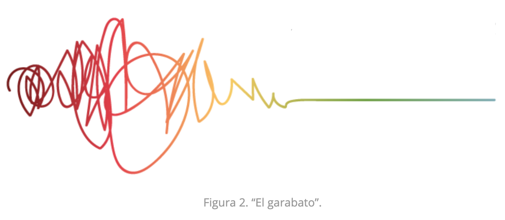

# Onboarding de coaches Voluntarios

## Índice

- [1. Preámbulo](#1-preámbulo)
- [2. The Laboratorian Way](#2-the-laboratorian-way)
- [3. Objetivos de aprendizaje](#3-objetivos-de-aprendizaje)
- [4. Coaches](#4-coaches-voluntarios)
- [5. Coaches Voluntarios](#5-coaches-voluntarios)
- [6. Entregables mínimos](#6-entregables-minimos)
- [7. Pistas, tips y lecturas complementarias](#7-pistas-tips-y-lecturas-complementarias)

---

## 1. Preámbulo

El conocimiento en “la Era del Conocimiento” se define y valora, no por lo que es, sino por lo que se puede hacer con él. Está producido, no necesariamente por individuos expertos, sino por una “Inteligencia colectiva” que no es otra cosa que grupos de personas con experiencias y habilidades complementarias que colaboran con propósitos específicos.»
Así, el trabajo de hoy se trata cada vez menos de seguir instrucciones, y cada vez más de resolver problemas colaborativamente, en un proceso plagado de incertidumbre, cambio y ambigüedad constantes. Una de sus características principales es que requiere encontrar soluciones “nuevas” a problemas “nuevos” o “desconocidos” y no de repetir una y otra vez, como en una fábrica, una tarea, o aplicar una solución ya conocida a un problema también conocido.
Es un proceso que podríamos decir se ve así:

que necesitan los estudiantes para sobrevivir y tener éxito en el siglo XXI. Educadores, gobiernos, fundaciones, empleadores e investigadores se refieren a estas habilidades como “habilidades del siglo XXI”, son habilidades de pensamiento de orden más alto, resultado de aprendizajes más profundos y habilidades complejas de pensamiento y comunicación. Hablamos de habilidades complejas y abstractas como: autogestión, trabajo en equipo, pensamiento crítico y pensamiento creativo.

## 2. The laboratorian way

Nuestro rol, es diseñar y facilitar un proceso de aprendizaje natural y ser consecuente del cambio de protagonismo.
es decir, desde el “Yo te enseño” hacia el “Yo aprendo”.

La tradicional idea de decir “yo te enseño” ha muerto para siempre en Laboratoria para dar paso al “YO APRENDO”. En Laboratoria no hay profesores, no hay clases dictadas, no hay cursos o materias, no hay pruebas ni exámenes estandarizados, no hay notas o calificaciones tradicionales; este será el primero de una larga lista de conflictos cognitivos que enfrentarán nuestras estudiantes durante 6 meses.

Nuestro diseño de la experiencia de aprendizaje debe permitirnos lograr dos objetivos, uno de muy largo plazo y otro de corto, muy pragmático. Queremos que nuestras estudiantes desarrollen habilidades del s. XXI, y entre ellas, que desarrollen la más importante de todas: aprender a aprender, es decir ser aprendices de por vida. Esto último significa tener la motivación personal y autodirigida para seguir aprendiendo en función del desarrollo personal y profesional, ese es nuestro objetivo último y de largo plazo. Desarrollar esa capacidad es mucho más importante que aprender cualquier herramienta de programación o técnica de diseño porque entendemos el aprendizaje como un proceso que dura toda la vida y consideramos que es la herramienta más poderosa para navegar en un mundo en constante cambio.

## 3. Objetivos de aprendizaje

> Si bien en un principio aún me cuestionaba el hecho de cómo podía aprender algo totalmente nuevo sin un profesor, ahora creo que puedo ser capaz de aprender por mí misma sin dejar de lado el feedback o autoevaluar sinceramente cómo voy respecto a mis objetivos de aprendizaje. » - Estudiante Lima 2019, semana 7 de bootcamp.

Nuestras estudiantes no están completando proyectos para hacer presentaciones, ellas están trabajando para autoeducarse, y la guía son los **objetivos de aprendizaje**. Los objetivos de aprendizaje son bullet points de habilidades especificas que ellas pueden alcanzar al finalizar cada uno de los proyectos, estos objetivos se ven así:

### UX

- [ ] Diseñar la aplicación pensando y entendiendo al usuario.
- [ ] Crear prototipos para obtener feedback e iterar.
- [ ] Aplicar los principios de diseño visual (contraste, alineación, jerarquía).

### Javascript

- [ ] Manipulación de strings.
- [ ] Uso de condicionales (if-else | switch).
- [ ] Uso de bucles (for | do-while).
- [ ] Uso de funciones (parámetros | argumentos | valor de retorno).
- [ ] Declaración correcta de variables (const & let).

### Testing

- [ ] Testeo de tus funciones.

Cada una de nuestras estudiantes al finalizar los sprints asignados al proyecto, se autoevalúa en cada uno de ellos y tiene una sesión con uno de sus coaches para reflexionar sobre lo que marco y lo que no marco, el coach valida y ayuda a la estudiante con la reflexión de su autoevaluación para decidir que objetivos se quieren priorizar en el siguiente proyecto, que tiene los suyos propios pero que también puede heredar algunos del anterior.

De esta manera eliminamos una rubrica (calificaciones) que no nos dá información correcta ni suficiente.

## 4. Coaches
En laboratoria tenemos un manifiesto que nos ayuda a entender nuestro rol como coaches, y que a su vez funciona como un mini código de conducta, para nosotros nuestras postulantes/estudiantes/egresadas son lo más importante y por ello cuidamos la forma en la que interactuamos con ellas, para nunca tener respuestas guiadas por prejuicios. 

Las relaciones interpersonales son la base de Laboratoria. Cada interacción que tenemos con una postulante/estudiante/egresada cuenta y el error se paga caro y por mucho tiempo. Nuestra relación con ellas es como la reputación: difícil de construir, pero muy fácil de perder. 

Cada uno de nuestros coaches no solo ha sido evaluado para pertenecer al equipo, tambien se encuentra en constante entrenamiento y también tiene acceso a feedback por parte de las estudiantes y su equipo, mismo que le permite mejorar constantemente sus interacciones, esto puede ser retador para la mayoría pero estamos seguros de que de esta manera nuestros coaches pueden ofreser la mejor asesoría dentro del área de trabajo.

la única cosa no negociable de cómo corremos el Bootcamp es seguir el valor de `We Care About Our Students`. No importa la metodología o la currícula que corramos, este valor siempre irá por encima de cualquier elemento de nuestro diseño.

## 5. Coaches voluntarios
Ahora que sabes que nuestros coaches tienen un perfil que les permite ejecutar los valores de laboratoria sin conflictos dentro del area de trabajo queremos que tu también los conoscas. Si interactúas con postulantes/estudiantes/egresadas, este manifiesto es para ti. Léelo, y entiéndelo. Si quieres saber qué puede suceder cuando no se cumple este manifiesto, lee este artículo: [The high cost of a free coding bootcamp](https://www.theverge.com/2020/2/11/21131848/lambda-school-coding-bootcamp-isa-tuition-cost-free)

## 6. Entregables mínimos

Para poder avanzar con el proceso de onboarding y que puedas participar en una edición de nuestro bootcamp como Coach voluntario(a), necesitamos que completes algunos entregables mínimos:

- Reflexionar sobre las particularidades del modelo de educación ágil de Laboratoria, completando [las preguntas guía](https://docs.google.com/forms/d/e/1FAIpQLSe4GsnceF83DAYNWmqqS-KZCDL-K2fFCC2YXIoT7MLcJeMuxQ/viewform?fbzx=529178039941947242)
- Tener una conversación con cualquier Laboratorian sobre los aprendizajes y lecciones colectivas que hemos recolectado a lo largo de los años.
- Tener una conversación con cualquier coach de Laboratoria sobre el modelo de educación ágil de Laboratoria, utilizando [las preguntas guía](https://docs.google.com/forms/d/e/1FAIpQLSe4GsnceF83DAYNWmqqS-KZCDL-K2fFCC2YXIoT7MLcJeMuxQ/viewform?fbzx=529178039941947242)

### ¿Por dónde empiezo?

Seguramente leíste esos entregables y no tienes idea de qué son, ni cómo alcanzarlos. Excelente, ya sabes lo que sienten las estudiantes de Laboratoria cuando empiezan su primer proyecto en el Bootcamp 😅.

Empieza por aquí: para mejor entendimiento del mindset, es importante que revises los siguientes recursos:

> [Lectura: Manifiesto del coach de Laboratoria](https://docs.google.com/document/d/1woa5WTntMLXLY1WDcLNW4hKY7W9VV0iO7iIkLduYz-E/edit#) // comprobar link

> [Essay: Why Books don't work](https://andymatuschak.org/books/)

> [TED Talk: The myth of average](https://www.youtube.com/watch?v=4eBmyttcfU4)

> [TED Talk: How to fix a broken school](https://www.ted.com/talks/linda_cliatt_wayman_how_to_fix_a_broken_school_lead_fearlessly_love_hard)

> [Video: Growth mindset](https://www.youtube.com/watch?v=Yl9TVbAal5s)

## 7. Pistas, tips y lecturas complementarias

> [Libro: The End of Average ](https://www.amazon.com/End-Average-Succeed-Values-Sameness/dp/B00YFOFYT4/ref=sr_1_2?adgrpid=82197445115&gclid=EAIaIQobChMIu4OU9Oz55gIVA4fVCh1LcAcEEAAYASAAEgJIX_D_BwE&hvadid=402156096693&hvdev=c&hvlocphy=9060924&hvnetw=g&hvpos=1t1&hvqmt=e&hvrand=828412069656065007&hvtargid=kwd-131007094614&hydadcr=22340_11226440&keywords=the+end+of+average&qid=1578687418&sr=8-2)

> [Paper: Active Learning](https://files.eric.ed.gov/fulltext/ED336049.pdf)

> [Video: Changing Education Paradigms](https://www.youtube.com/watch?v=zDZFcDGpL4U)
